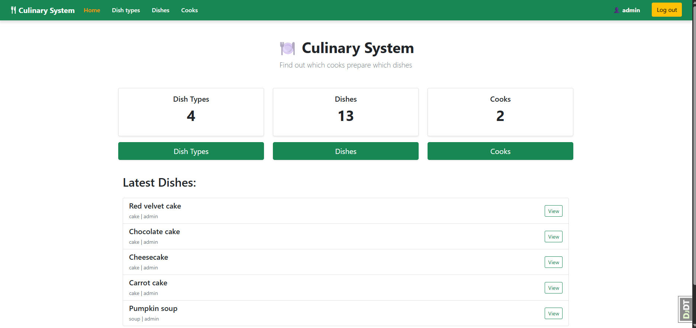
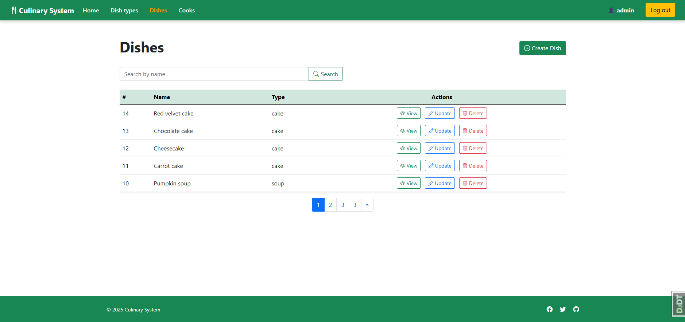

# Culinary System

A Django-based web application for managing dishes, cooks, and dish types.

## Check it out!

[Culinary System deployed to Render]()

## Features

- CRUD operations for:
  - Dishes
  - Dish Types
  - Cooks
- Search functionality for models
- User/Cook authentication
- Bootstrap 5 frontend for responsive UI
- Pagination support

## Installation

Python3 must be installed

```shell
    git clone https://github.com/sachavskyi/culinary-system.git
    cd culinary-system
    python -m venv venv
    venv\Scripts\activate
    pip install -r requirements.txt
    python manage.py runserver
```

## Demo
### Home page:


### Dish list page:

